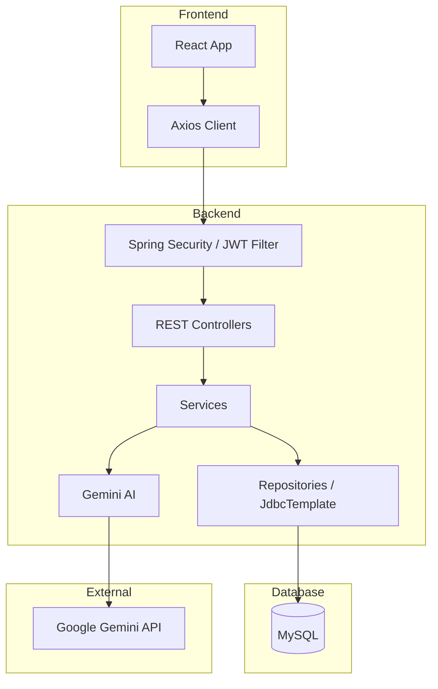
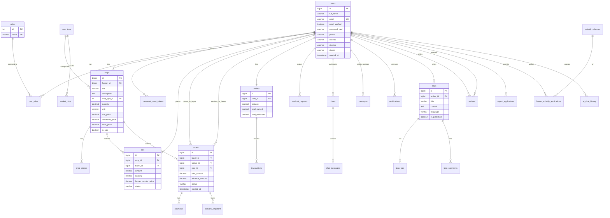

# 🌾 Agro Connect

**Smart Agriculture Marketplace & Advisory Platform for Bangladesh**

A comprehensive digital platform connecting farmers, buyers, and agricultural experts. Built with Spring Boot (Java 25) and React + TypeScript.


---

## 📋 Table of Contents

- [Features](#-features)
- [Tech Stack](#-tech-stack)
- [Architecture](#-architecture)
- [Database ERD](#-database-erd)
- [Getting Started](#-getting-started)
- [Environment Configuration](#-environment-configuration)
- [API Endpoints](#-api-endpoints)
- [User Roles](#-user-roles)
- [Project Structure](#-project-structure)

---

## ✨ Features

### 🧑‍🌾 For Farmers

- **Product Listing** - List crops with images, pricing, and quantity
- **B2B & Retail Sales** - Sell wholesale (80kg+) or retail (100g-10kg)
- **Bidding System** - Receive bids from buyers, counter-offer, negotiate
- **Wallet & Cashout** - Track earnings, request withdrawals
- **AI Assistant** - Get agricultural advice in Bangla via Gemini AI
- **Export Applications** - Apply for export permits

### 🛒 For Buyers

- **Marketplace** - Browse products by category, location
- **Bidding** - Place bids on wholesale products
- **Order Management** - Track orders, view invoices
- **Direct Messaging** - Chat with farmers

### 👨‍🔬 For Agronomists (Experts)

- **Blog Posts** - Publish agricultural tips and articles
- **Advisory** - Provide expert consultation

### 🔐 For Admins

- **User Management** - Manage all users and roles
- **Product Management** - Approve products, manage inventory
- **Order Management** - Track and update order status
- **Cashout Approvals** - Process farmer withdrawal requests
- **Export Applications** - Review and approve exports
- **Platform Analytics** - View revenue, statistics

---

## 🛠️ Tech Stack

### Backend

| Technology          | Version | Purpose                        |
| ------------------- | ------- | ------------------------------ |
| Java                | 25      | Main Language                  |
| Spring Boot         | 4.0.0   | Backend Framework              |
| Spring Security     | 6.x     | Authentication & Authorization |
| JWT                 | 0.12.6  | Token-based Authentication     |
| MySQL               | 8.0+    | Database                       |
| Flyway              | -       | Database Migrations            |
| Cloudinary          | 1.39.0  | Cloud Image Storage            |
| Apache HttpClient 5 | -       | AI API Calls                   |

### Frontend

| Technology   | Version | Purpose      |
| ------------ | ------- | ------------ |
| React        | 18      | UI Framework |
| TypeScript   | 5.x     | Type Safety  |
| Tailwind CSS | 3.x     | Styling      |
| Vite         | 5.x     | Build Tool   |
| Axios        | -       | HTTP Client  |

### AI Integration

| Service       | Model     | Purpose                   |
| ------------- | --------- | ------------------------- |
| Google Gemini | 2.0 Flash | Agricultural AI Assistant |

### Cloud Services

| Service    | Purpose                     |
| ---------- | --------------------------- |
| Cloudinary | Image upload & CDN delivery |

---

## 🏗️ Architecture



---

## 📊 Database ERD



---

## 🚀 Getting Started

### Prerequisites

- **Java 25** (JDK 25 or higher)
- **Node.js 18+** with npm
- **MySQL 8.0+**
- **Maven 3.9+**
- **Gemini API Key** (for AI features)

### Installation

#### 1. Clone the Repository

```bash
git clone https://github.com/yourusername/agro-connect.git
cd agro-connect
```

#### 2. Set Up Database

```sql
CREATE DATABASE agro_connect
    CHARACTER SET utf8mb4
    COLLATE utf8mb4_unicode_ci;
```

#### 3. Configure Environment Variables

Copy the example environment file and update with your values:

```bash
cp .env.example .env
```

Edit `.env` with your credentials:

```env
# Database
DB_HOST=localhost
DB_PORT=3306
DB_NAME=agro_connect
DB_USERNAME=root
DB_PASSWORD=your_password

# JWT
JWT_SECRET=your_secure_jwt_secret_key_here

# AI (Get from https://aistudio.google.com/app/apikey)
AI_GEMINI_KEY=your_gemini_api_key

# Email (SMTP)
MAIL_USERNAME=your_email@gmail.com
MAIL_PASSWORD=your_app_password

# Admin
ADMIN_EMAIL=admin@agro.com
ADMIN_PASSWORD=admin123

# Cloudinary (Get from https://console.cloudinary.com/pm/settings/api-keys)
CLOUDINARY_CLOUD_NAME=your_cloud_name
CLOUDINARY_API_KEY=your_api_key
CLOUDINARY_API_SECRET=your_api_secret
```

#### 4. Start Backend

```bash
# Install dependencies & run
./mvnw spring-boot:run
```

The backend will start at `http://localhost:8080`

#### 5. Start Frontend

```bash
cd frontend
npm install
npm run dev
```

The frontend will start at `http://localhost:5173`

---

## ⚙️ Environment Configuration

| Variable                | Description            | Default                 |
| ----------------------- | ---------------------- | ----------------------- |
| `DB_HOST`               | MySQL host             | `localhost`             |
| `DB_PORT`               | MySQL port             | `3306`                  |
| `DB_NAME`               | Database name          | `agro_connect`          |
| `DB_USERNAME`           | Database user          | `root`                  |
| `DB_PASSWORD`           | Database password      | -                       |
| `JWT_SECRET`            | JWT signing key        | (default provided)      |
| `JWT_EXPIRATION`        | Token expiry (ms)      | `86400000` (24h)        |
| `AI_GEMINI_KEY`         | Gemini API key         | -                       |
| `MAIL_HOST`             | SMTP server            | `smtp.gmail.com`        |
| `MAIL_PORT`             | SMTP port              | `587`                   |
| `MAIL_USERNAME`         | Email address          | -                       |
| `MAIL_PASSWORD`         | Email password         | -                       |
| `ADMIN_EMAIL`           | Initial admin email    | `admin@agro.com`        |
| `ADMIN_PASSWORD`        | Initial admin password | `admin123`              |
| `FRONTEND_URL`          | Frontend URL           | `http://localhost:5173` |
| `CLOUDINARY_CLOUD_NAME` | Cloudinary cloud name  | -                       |
| `CLOUDINARY_API_KEY`    | Cloudinary API key     | -                       |
| `CLOUDINARY_API_SECRET` | Cloudinary API secret  | -                       |

---

## 📡 API Endpoints

### Authentication

| Method | Endpoint                    | Description            |
| ------ | --------------------------- | ---------------------- |
| POST   | `/api/auth/signup`          | Register new user      |
| POST   | `/api/auth/login`           | Login & get token      |
| POST   | `/api/auth/forgot-password` | Request password reset |
| POST   | `/api/auth/reset-password`  | Reset password         |
| GET    | `/api/auth/me`              | Get current user       |

### Crops & Marketplace

| Method | Endpoint             | Description      |
| ------ | -------------------- | ---------------- |
| GET    | `/api/crops`         | List all crops   |
| GET    | `/api/crops/{id}`    | Get crop details |
| POST   | `/api/crops`         | Add new crop     |
| PUT    | `/api/crops/{id}`    | Update crop      |
| GET    | `/api/shop/products` | Retail products  |

### Bidding

| Method | Endpoint                 | Description          |
| ------ | ------------------------ | -------------------- |
| POST   | `/api/bids/{cropId}`     | Place bid            |
| GET    | `/api/bids/my-bids`      | Get my bids          |
| GET    | `/api/bids/farmer-bids`  | Get bids on my crops |
| PUT    | `/api/bids/{id}/counter` | Counter-offer        |
| PUT    | `/api/bids/{id}/accept`  | Accept bid           |

### Orders

| Method | Endpoint                   | Description      |
| ------ | -------------------------- | ---------------- |
| POST   | `/api/orders/create`       | Create order     |
| GET    | `/api/orders/my-orders`    | Get my orders    |
| GET    | `/api/orders/{id}/invoice` | Download invoice |

### AI Chat

| Method | Endpoint         | Description     |
| ------ | ---------------- | --------------- |
| POST   | `/api/ai/chat`   | Chat with AI    |
| GET    | `/api/ai/health` | Check AI status |

### Admin

| Method | Endpoint                          | Description       |
| ------ | --------------------------------- | ----------------- |
| GET    | `/api/admin/users`                | List all users    |
| GET    | `/api/admin/crops`                | List all products |
| GET    | `/api/admin/orders`               | List all orders   |
| POST   | `/api/admin/cashout/{id}/approve` | Approve cashout   |

---

## 👥 User Roles

| Role                 | Code                    | Permissions                                     |
| -------------------- | ----------------------- | ----------------------------------------------- |
| **Farmer**           | `ROLE_FARMER`           | List crops, receive bids, manage orders, wallet |
| **Buyer**            | `ROLE_BUYER`            | Browse marketplace, place bids, order wholesale |
| **General Customer** | `ROLE_GENERAL_CUSTOMER` | Buy retail products                             |
| **Agronomist**       | `ROLE_AGRONOMIST`       | Write blogs, provide expert advice              |
| **Admin**            | `ROLE_ADMIN`            | Full platform management                        |

---

## 📁 Project Structure

```
agro-connect/
├── src/main/java/com/arpon007/agro/
│   ├── config/           # Configuration classes
│   ├── controller/       # REST API controllers
│   ├── dto/              # Data Transfer Objects
│   ├── model/            # Entity models
│   ├── repository/       # Database repositories
│   ├── security/         # JWT, Security config
│   └── service/          # Business logic
├── src/main/resources/
│   ├── application.properties
│   ├── schema.sql        # Database schema
│   └── db/migration/     # Flyway migrations
├── frontend/
│   ├── src/
│   │   ├── api/          # API client
│   │   ├── components/   # UI components
│   │   ├── dashboards/   # Dashboard pages
│   │   ├── pages/        # Public pages
│   │   └── context/      # React contexts
│   └── package.json
├── .env.example          # Environment template
├── pom.xml               # Maven dependencies
└── README.md
```

---

## 🤝 Contributing

1. Fork the repository
2. Create feature branch (`git checkout -b feature/amazing-feature`)
3. Commit changes (`git commit -m 'Add amazing feature'`)
4. Push to branch (`git push origin feature/amazing-feature`)
5. Open a Pull Request

---

## 📄 License

This project is licensed under the MIT License.

---

## 👨‍💻 Author

**MD. SHAZAN MAHMUD ARPON**

- GitHub: [@arpondark](https://github.com/arpondark)

---

<div align="center">

**🌾 Agro Connect - Empowering Farmers Through Technology 🌾**

</div>
